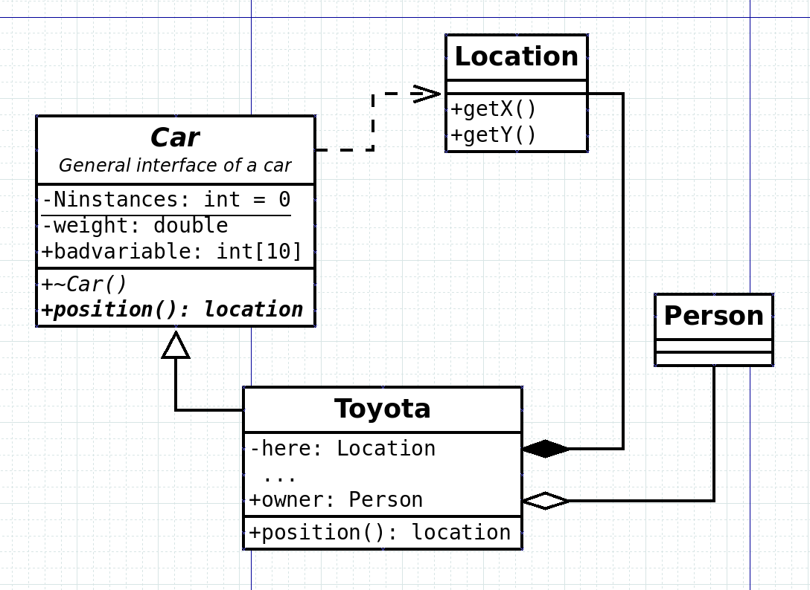
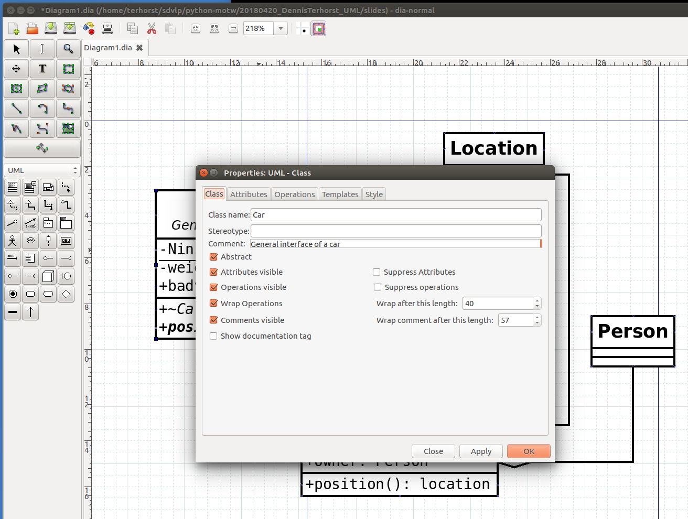

# UML Standard

## Standard / Specification

  * Definition by *Object Management Group* (OMG) (till 2005), now *International Organization for Standardization* (ISO)
  * [Specification documents](https://www.omg.org/spec/UML)
    * [UML/2.5.1/PDF](https://www.omg.org/spec/UML/2.5.1/PDF)

## Diagrams

   UML 2 defines categories

   

## TOC

   1. Scope
   2. Conformance
   3. Normative References
   4. Terms and Definitions
   5. Notational Conventions
   6. Addtitional Information

## TOC (continued)

   7. Common Structure
   8. Values
   9. Classification
   10. Simple Classifiers
   11. Structured Classifiers
   12. Packages
   13. Common Behaviour
   14. State Machines

## TOC (continued)

   15. Activities
   16. Actions
   17. Interactions
   18. UseCases
   19. Deployments
   20. Information Flows
   21. Primitive Types
   22. Standard Profile

## Abstract Syntax

   <!-- ](UML-abstract-syntax.png){height=550} -->

   {height=530}

# Examples / Usage

## Classes

   {height=530}

## Inheritance

   {height=530}

## Dia

   {height=550}

# Hands-On

## Dia2code

