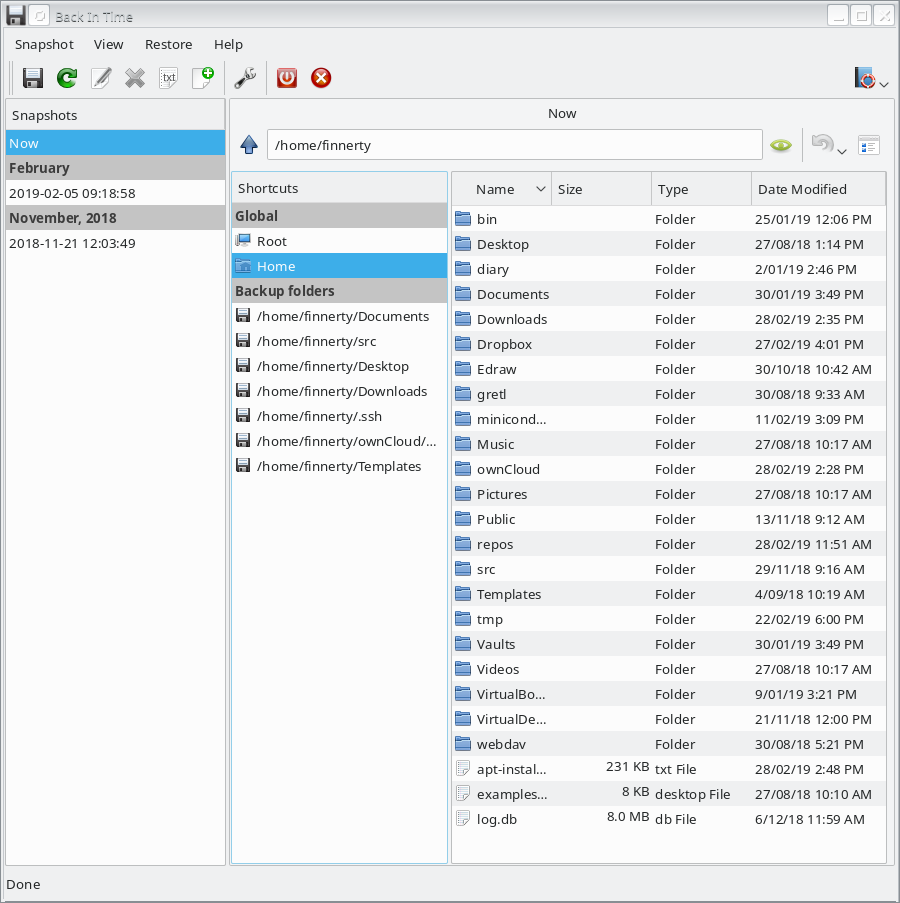
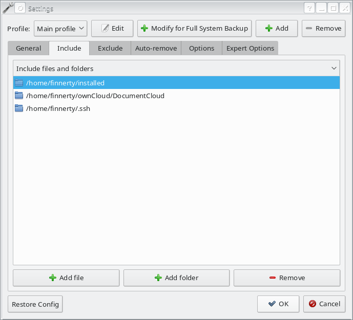
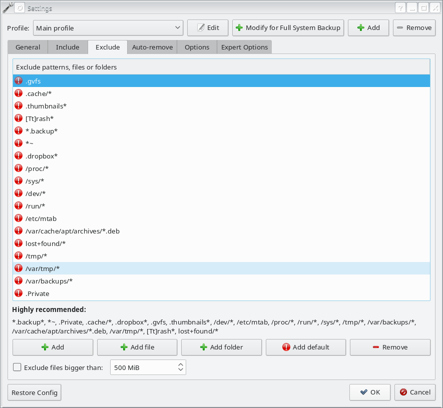
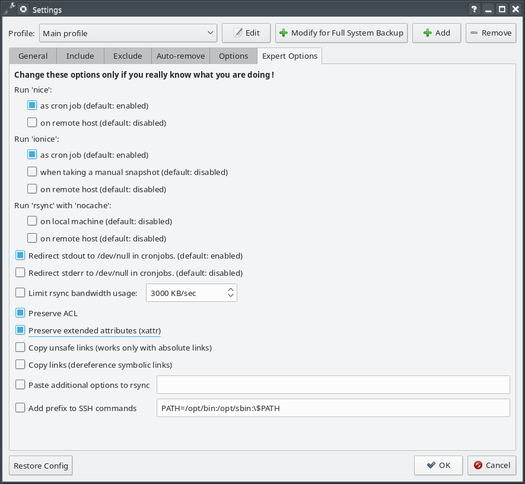

# My harddrive broke and all my work is gone. I should have made some backups..

## What is the purpose of a backup?

## What is the purpose of a backup?

* Safety
* Versioning
* Definitive location

## What is a definitive location?

## What is a definitive location?


## What type of backup?

### Archive

* Multiple versions of files kept.
* Able to return to an earlier version.
* Requires more disk space.

### Backup

* Stores a copy of content at a given point.
* Requires only as much disk space as the original.

## Where to backup?

* Convenience versus security
  
* External disk
  * Have to attach and activate software
  * Same location as laptop
  * Acts as mirror
* Backup server
  * Have to be connected to a network
  * Different location to laptop
  * Server backed by RAID storage

## How often to backup?

* For an archive
  * How often do you want to save a new version?
* For a backup
  * How often do you want to save the current version?

# How To Backup

## What to back-up

## Laptop Meta-data.

```
    dpkg --get-selections > ~/installed/installed.txt
    sudo cp -R /etc/apt/sources.list* ~/installed/
    sudo apt-key exportall > ~/installed/repo.keys
    sudo chown -R finnerty:finnerty ~/installed
```

## Directory organisation

* Separate what to back up.

## Example 1
- bin
- Desktop (empty)
- Downloads
- Documents
- data
- installed
- mounts
  - webdav (etc.)
- ownCloud
  - **DocumentCloud**
    - **own-folder-1**
    - **own-folder-2**
  - shared-folder-1
  - shared-folder-2
- repositories
- src
- vaults
- virtual-machines

## Example 2
- Projects
  - project-1
    - repositories
    - data
    - **documents**
  - project-2
    - repositories
    - data
    - **documents**

# back-in-time

## Main Interface




## General settings


## Schedule your back up


## What to include



## What to exclude



## How to set up archive


## More details


## Even more details


